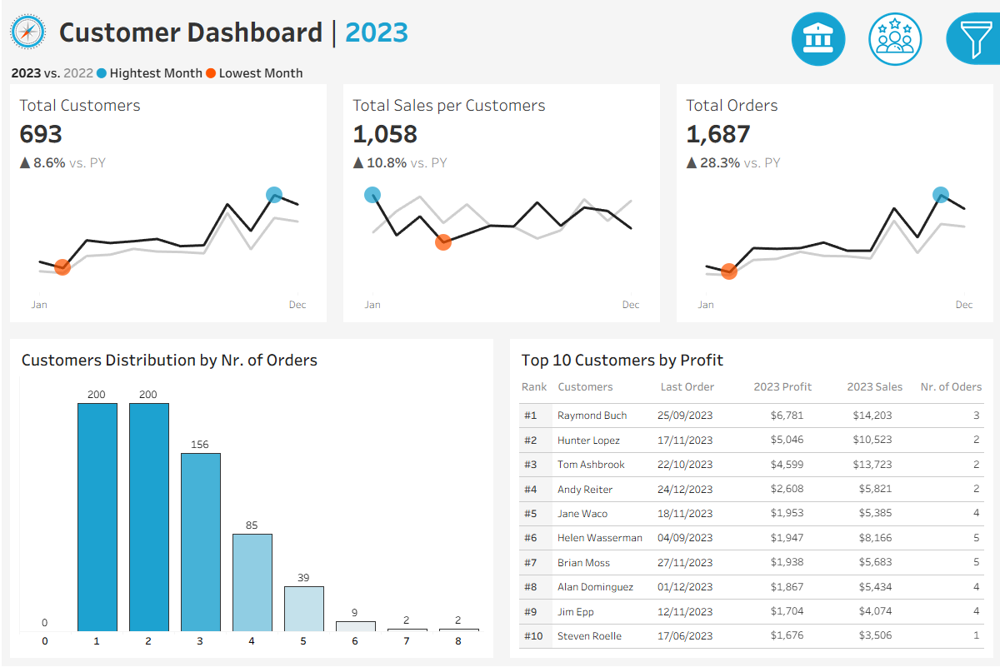

# 📊 Sales & Customer Dashboards (Tableau)

## Problem Statement

Sales and marketing teams need a clear way to monitor **year-over-year performance**, identify **sales and profit trends**, and understand **customer behavior** across products and regions.
This project converts raw transactional data (2020–2023) into **stakeholder-ready Tableau dashboards** to support data-driven decision-making.

---

## Project Overview

This project delivers two interactive Tableau dashboards focused on **sales performance** and **customer analysis**, enabling executives and analysts to explore KPIs, trends, and customer segments dynamically.

* **Time Period:** 2020–2023
* **Focus Year (Dashboard View):** 2023
* **Target Users:** Sales managers, executives, marketing teams

---

## Dashboards

### 📈 Sales Performance Dashboard


* Year-over-year KPIs: **Total Sales, Profit, Quantity**
* Monthly and weekly trend analysis
* Identification of **highest and lowest performing periods**
* Product subcategory analysis with **sales vs. profit comparison**
* Above/below average weekly performance indicators

---

### 👥 Customer Analysis Dashboard



* Customer KPIs: **Total Customers, Sales per Customer, Orders**
* Monthly customer trends with YoY comparison
* Customer distribution by **number of orders**
* **Top 10 customers by profit**, including order count and recency

---

## Key Insights (2023)

* **Strong YoY Growth:** Sales, profit, quantity, and total orders all increased compared to 2022, indicating overall business growth.
* **Seasonality Identified:** Both sales and customer activity peaked toward the end of the year, highlighting seasonal demand patterns.
* **Profit ≠ Sales:** Some product subcategories generated high sales but relatively lower profits, emphasizing the importance of margin analysis.
* **Customer Concentration:** A small group of high-value customers contributed a disproportionate share of total profit.
* **Engagement Pattern:** Most customers placed 1–3 orders, while repeat customers (4+ orders) represent a smaller but valuable segment.

---

## Data Analyst Skills Demonstrated

* KPI definition and **year-over-year analysis**
* Time-series analysis (monthly & weekly trends)
* Customer segmentation and behavioral analysis
* Business-focused data storytelling
* Interactive dashboard design for stakeholders
* Translating requirements into analytical solutions

---

## Tools & Technologies

* **Tableau Public**
* CSV data modeling and joins
* Business intelligence & visual analytics

---

## Projects Structure

```
📁 TABLEAU_project_sales-customers
│
├── 📁 dashboards
│   ├── sales_performance_dashboard.png
│   ├── customers_analysis_dashboard.png
│
├── 📁 data
│   ├── Customers.csv
│   ├── Orders.csv
│   ├── Products.csv
│   └── Order.csv
│
├── 📁 tableau
│   └── Sales & Customers Analysis.twbx
│
├── README.md
└── LICENSE 

```

---

## Tableau Public

🔗 **Live Tableau Dashboards:** [View on Tableau Public](https://public.tableau.com/app/profile/huy.hoang.nguyen5826/viz/SalesCustomersAnalysisDatawithBaraa/SalesDashboard)

---

## Notes

This project was developed for **data analyst portfolio purposes**.

---
